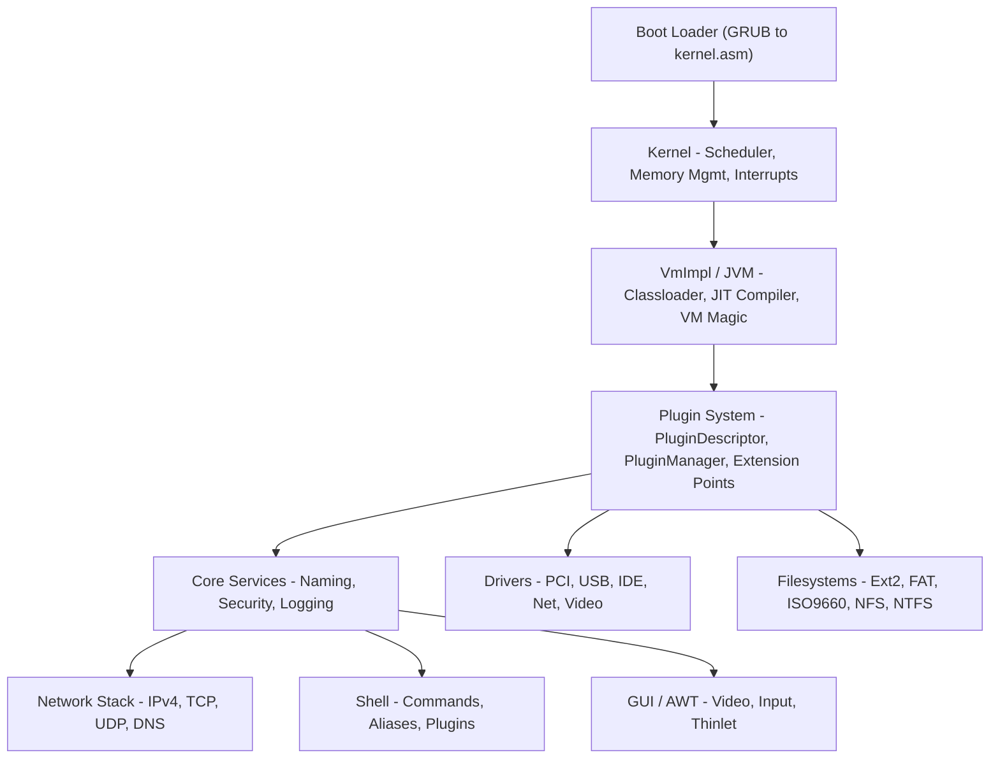

# Architecture Overview

## High-Level Components



## Key Design Principles

### 1. Java-First
> 95%+ of code is Java. Only ~25 assembly files for:
- `kernel.asm` — entry point, GDT/IDT setup, context switch
- `vm.asm` — VM primitives, stack frame layout, safepoints
- `mm32.asm` / `mm64.asm` — Memory management, page tables
- `apic.asm` — Local APIC, IPI handling

### 2. Isolate-Based Architecture
JNode uses **Isolates** (similar to processes but lighter-weight):
- Each isolate has its own classloader, heap, thread groups
- Communication via **channels** (typed message passing)
- Security via **capabilities** (unforgeable references)
- See [Isolate Implementation](https://github.com/LSantha/jnode_ai/wiki/Isolate-Implementation)

### 3. Plugin System
- **PluginDescriptor** (XML) declares exports/imports
- **PluginManager** resolves dependencies at boot
- Extension points for: filesystems, drivers, shell commands, network layers
- See [Plugin System](https://github.com/LSantha/jnode_ai/wiki/Plugin-System)

### 4. MMTk Integration
- **Memory Management Toolkit** bindings for garbage collection
- Available MMTk plans: `org.jnode.vm.memmgr.mmtk.ms` (MarkSweep), `...genrc` (generational), `...nogc` (no collection)
- Default memory manager is `org.jnode.vm.memmgr.def`; MMTk plans are experimental
- See [MMTk Bindings](https://github.com/LSantha/jnode_ai/wiki/MMTk-Bindings)

### 5. VMMagic Annotations
- `@Uninterruptible`, `@Inline`, `@Offset`, `@Address`
- Enable low-level operations in Java
- Processed by JNasm and BootImageBuilder
- See [VMMagic Annotations](https://github.com/LSantha/jnode_ai/wiki/VMMagic-Annotations)

## Boot Sequence

1. **GRUB** loads `kernel.asm` at 1 MB
2. **kernel.asm**: GDT, IDT, paging, enter protected mode
3. **VmImpl.<clinit>**: Boot classloader, VM magic init
4. **PluginManager**: Load `default-plugin-list.xml`
5. **Core services**: Naming, Security, DeviceManager
6. **Drivers**: PCI enumeration, device matching
7. **Filesystems**: Mount root (ISO9660 → ramdisk)
8. **Shell**: Start `init` isolate → command prompt

See [Boot Sequence](https://github.com/LSantha/jnode_ai/wiki/Boot-Sequence) for detailed trace.

## Memory Layout (x86, 32-bit)

```
0xFFFFFFFF ┌─────────────────────┐
           │   Kernel Space      │  1 GB (0xC0000000–0xFFFFFFFF)
           │   (Identity mapped) │
0xC0000000 ├─────────────────────┤
           │   User / Isolate    │  3 GB (0x00000000–0xBFFFFFFF)
           │   Heaps, Stacks     │
0x00000000 └─────────────────────┘
```

- **Kernel** runs at high addresses (negative pointers)
- **Isolates** allocated in low 3 GB
- **Direct memory** via `VmUnsafe` for DMA, framebuffer

See [Paging Implementation](https://github.com/LSantha/jnode_ai/wiki/Paging-Implementation) and [Memory Management](https://github.com/LSantha/jnode_ai/wiki/Memory-Management).

## Threading & Scheduling

- **Green threads** mapped 1:1 to kernel threads
- **Priority-based preemptive** scheduler
- **Yieldpoints** at method calls, loop backedges, allocations
- **IsolateThread** = Java thread + kernel context
- See [Core Thread Scheduling](https://github.com/LSantha/jnode_ai/wiki/Core-Thread-Scheduling)

## JIT Compilers

| Compiler | Tier | Status |
|----------|------|--------|
| **L1A / L1B** | Baseline | Default |
| **Stub** | Stub generation | For non-Java natives |
| **L2** | Optimizing | Test-only, not selected at boot |

- L1A/L1B: baseline bytecode compilers; `jnode.compiler` accepts `L1A`, `L1B`, or `default` (→ L1A)
- L2: optimizing compiler, used only in test harness (`testCompilers`)
- See [JIT Compilers](https://github.com/LSantha/jnode_ai/wiki/JIT-Compilers)

## Further Reading

| Topic | Wiki Page |
|-------|-----------|
| Kernel Entry Point | [Kernel-Entry-Point](https://github.com/LSantha/jnode_ai/wiki/Kernel-Entry-Point) |
| Device Manager | [Device-Manager](https://github.com/LSantha/jnode_ai/wiki/Device-Manager) |
| Driver Framework | [Driver-Framework](https://github.com/LSantha/jnode_ai/wiki/Driver-Framework) |
| Filesystem Layer | [Filesystem-Layer](https://github.com/LSantha/jnode_ai/wiki/Filesystem-Layer) |
| Network Stack | [Network-Stack](https://github.com/LSantha/jnode_ai/wiki/Network-Stack) |
| Object Layout | [Object-Layout](https://github.com/LSantha/jnode_ai/wiki/Object-Layout) |
| Stack Frame Layout | [Stack-Frame-Layout](https://github.com/LSantha/jnode_ai/wiki/Stack-Frame-Layout) |
| Virtual Methods Dispatch | [Virtual-Methods-Dispatch](https://github.com/LSantha/jnode_ai/wiki/Virtual-Methods-Dispatch) |
