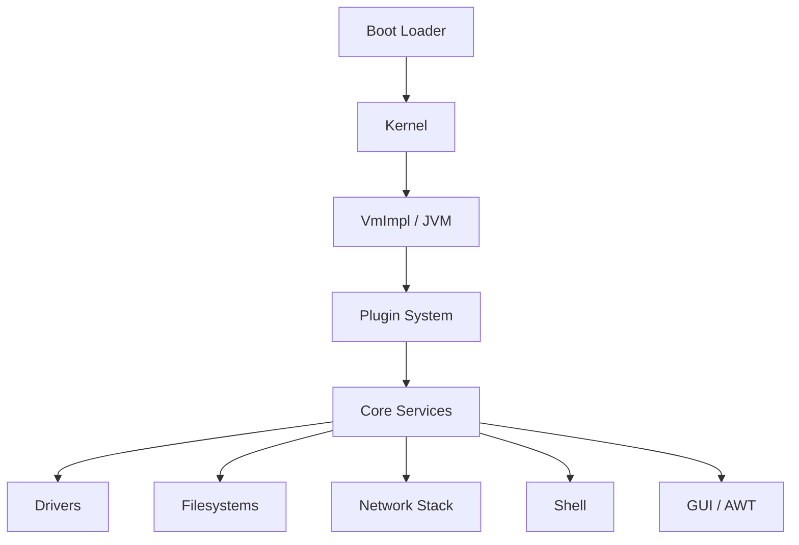

# JNode — A Java Operating System

**JNode** is a complete operating system written primarily in Java, with a small amount of assembly for the lowest-level hardware interaction. It includes a custom JVM, kernel, device drivers, filesystems, network stack, shell, and GUI — all in Java.

---

## Quick Links

| Topic | Description |
|-------|-------------|
| [:material-rocket-launch: Quick Start](getting-started/quick-start.md) | Build and boot your first JNode ISO in 5 minutes |
| [:material-hammer-wrench: Building](getting-started/building.md) | Detailed build instructions for x86 and x86_64 |
| [:material-cpu-64-bit: Run in QEMU](getting-started/qemu.md) | Test JNode in QEMU with serial logging |
| [:material-virtualbox: Run in VirtualBox](getting-started/virtualbox.md) | JDWP debugging support via VirtualBox |

---

## Architecture Overview

JNode consists of several major components:

See [Architecture Overview](architecture/overview.md) for details.

---

## Subsystems

| Subsystem | Description | Wiki Reference |
|-----------|-------------|----------------|
| [Filesystems](subsystems.md#filesystems) | Ext2/3, FAT, ISO9660, NFS2, exFAT, HFS+, NTFS | [Filesystem-Layer](https://github.com/LSantha/jnode_ai/wiki/Filesystem-Layer) |
| [Network Stack](subsystems.md#network-stack) | IPv4, TCP, UDP, DNS, NetAPI | [Network-Stack](https://github.com/LSantha/jnode_ai/wiki/Network-Stack) |
| [Shell](subsystems.md#shell) | Commands, syntax, aliases, plugins | [Shell-Commands](https://github.com/LSantha/jnode_ai/wiki/Shell-Commands) |
| [GUI/AWT](subsystems.md#gui-awt) | Video drivers, input, AWT peers, Thinlet | [GUI-AWT](https://github.com/LSantha/jnode_ai/wiki/GUI-AWT) |
| [Drivers](subsystems.md#drivers) | PCI, USB, IDE, SCSI, Ethernet, Audio | [Driver-Framework](https://github.com/LSantha/jnode_ai/wiki/Driver-Framework) |

See [Subsystems](subsystems.md) for details.

---

## Development

- [Build & Test](development/index.md) — Ant-based build, JUnit, regression tests
- [Testing](development/testing.md) — JUnit, regression tests, JDWP integration tests

---

## Reference

- [Commands](reference.md#shell-commands) — Shell command reference
- [Boot Parameters](reference.md#boot-parameters) — GRUB/kernel boot options
- [Configuration](reference.md#configuration-files) — `jnode.properties`, plugin lists

See [Reference](reference.md) for details.

---

## External Documentation

!!! info "Full Wiki"
    The [JNode Wiki](https://github.com/LSantha/jnode_ai/wiki) contains 100+ detailed technical pages covering every subsystem, class, and design decision. This site provides a curated entry point; the wiki is the exhaustive reference.

---

## Community

- **Issues**: [GitHub Issues](https://github.com/LSantha/jnode_ai/issues)
- **CI**: [GitHub Actions](https://github.com/LSantha/jnode_ai/actions)

---

*JNode is licensed under the GNU Lesser General Public License v2.1. See [LGPL v2.1](https://www.gnu.org/licenses/lgpl-2.1.html) for details.*
